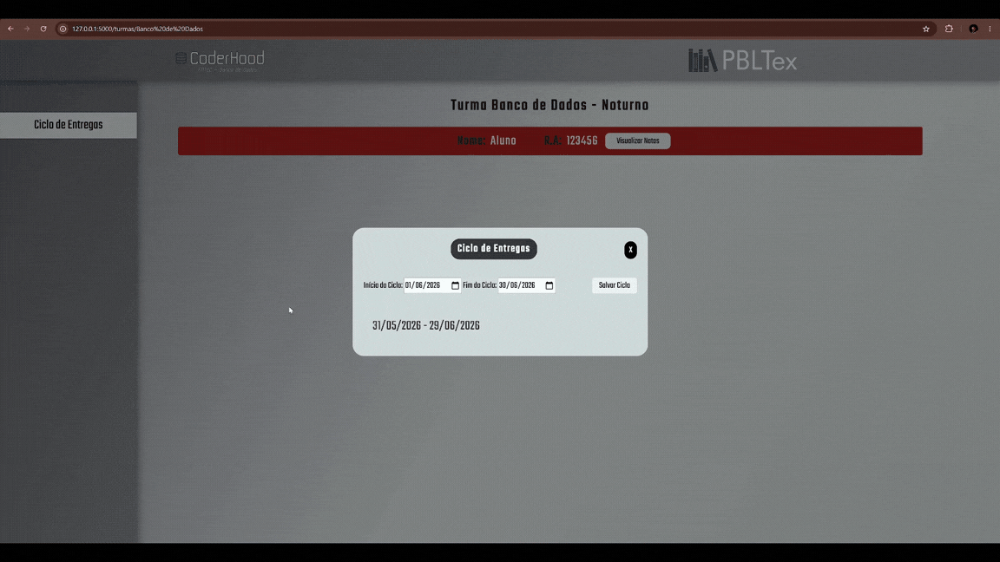
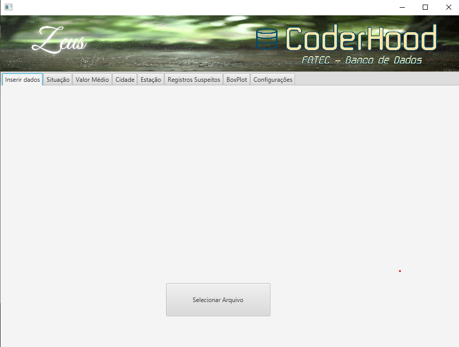
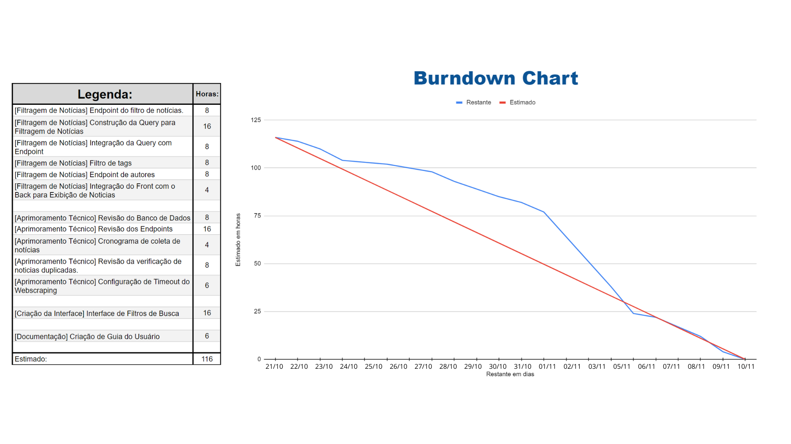

# Cesar Augusto Anselmo Pelogia Truyts


## Introdução

Este portfólio acadêmico foi construído com projetos realizados em minha formação em Tecnologia em Banco de Dados pela [Faculdade de Tecnologia de São José dos Campos - Prof. Jessen Vidal](https://fatecsjc-prd.azurewebsites.net/).

Ingressei no segundo semestre do ano de 2023, após uma transição de carreira de 15 anos na indústria, onde atuava como técnico em mecânica formado pelo Instituto de Tecnologia de Jacareí. Desde então, tive a oportunidade de trabalhar em equipe, desenvolvendo habilidades técnicas enquanto construía soluções para problemas reais, trazidos por empresas parceiras.

Durante minha trajetória na FATEC, construí uma formação abrangente que une desenvolvimento full-stack, gestão de equipes ágeis e arquitetura de sistemas. Percorri um caminho que foi dos fundamentos em HTML, CSS e JavaScript até a implementação de soluções backend robustas com Java e Spring Boot, passando por experiências significativas com dados geoespaciais, integração de APIs REST e bancos de dados relacionais e geoespaciais (PostgreSQL, PostGIS). Atuei como Scrum Master em múltiplos projetos, desenvolvendo competências em liderança técnica, planejamento de sprints e adaptação a ambientes dinâmicos.

Me encontrei na área de dados e arquitetura de sistemas, onde busco constantemente evoluir como desenvolvedor e arquiteto de soluções.

## Meus Projetos

## :heavy_check_mark: Em 2023-2

### Parceiro Acadêmico
[Faculdade de Tecnologia de São José dos Campos - Prof. Jessen Vidal](https://fatecsjc-prd.azurewebsites.net/)

<details>
<summary>Fatec São José dos Campos - Prof. Jessen Vidal</summary>

<b>Figura 1: Fachada da Fatec SJC</b>
</details>

Criada em 2 de março de 2006, a FATEC São José dos Campos - Prof. Jessen Vidal é uma Faculdade de Tecnologia do Estado de São Paulo que pertence ao Centro Estadual de Educação Tecnológica Paula Souza (CEETEPS) e oferece cursos gratuitos no formato Tecnólogo.

Sendo a empresa parceira no primeiro semestre, com a alcunha de PBLTex, a Fatec propôs um desafio relacionado à gestão educacional: a instituição utiliza ciclos de avaliação para cálculo do FEE (Fator de Ensino Evolutivo), porém não possuía um sistema para gerenciamento e acompanhamento desses dados. O problema central era a ausência de uma ferramenta que permitisse controle e rastreabilidade das avaliações realizadas em cada ciclo.

A [CoderHood](https://github.com/CoderHood-Fatec/ProjetoCoderHood) desenvolveu uma aplicação web para gerenciamento dos ciclos de avaliação, cobrindo desde o cadastro de turmas, alunos e professores até o lançamento de notas por ciclo e a exportação dos resultados em CSV. O backend, implementado com Flask, expõe endpoints REST que respondem tanto à renderização de páginas via Jinja quanto a requisições assíncronas do frontend.

<details>
<summary>Cadastro de notas e exibição de média em um ciclo</summary>

<b>Figura 2: Cadastro de notas e exibição de média em um ciclo</b>
</details>

A persistência é feita em arquivos JSON, com carregamento em memória na inicialização e gravação a cada operação. O cálculo da média ponderada por aluno é realizado no servidor a partir das notas registradas em cada ciclo, e o resultado é exibido na tela de detalhes da turma.

<details>
<summary>Modelagem de Dados em JSON</summary>

<b>Figura 3: Modelagem de Dados em formato Json</b>
</details>

### Tecnologias Utilizadas

- **HTML5 / CSS3:** Estruturação e estilização das páginas da aplicação, com estilos isolados por tela (login, área do professor, detalhe de turma, lançamento de notas).
- **JavaScript:** Responsável pela lógica do frontend, incluindo requisições assíncronas via `fetch` para os endpoints do backend e manipulação dinâmica do DOM.
- **Flask:** Microframework Python utilizado como backend monolítico, concentrando roteamento, regras de negócio, geração de ID e persistência em um único módulo.
- **JSON:** Formato utilizado para persistência dos dados de turmas, alunos e professores em arquivos no servidor, sem uso de banco de dados relacional.
- **Git / GitHub:** Ferramentas de versionamento e colaboração utilizadas para controle de versão e trabalho em equipe.

### Contribuições Pessoais

Foi o primeiro semestre, e o trabalho refletia exatamente isso. Atuei no front-end e no back-end, ainda aprendendo a conectar as duas pontas. Implementei a funcionalidade de edição de alunos, desde a interface integrada ao menu do professor até a rota de consulta por ID no back-end e a integração via fetch. Pequeno para quem já tem experiência, relevante para quem estava aprendendo o que significa fazer uma tela conversar com um servidor.

Também reorganizei a estrutura dos dados em JSON, criando vínculos consistentes entre alunos e turmas. Foi a primeira vez que precisei pensar em como os dados se relacionam antes de pensar em como exibi-los. A estilização das telas de login e gestão de alunos veio junto, consolidando uma identidade visual mínima para o projeto.

Na documentação, trabalhei na padronização dos requisitos funcionais e na reorganização do backlog seguindo diretrizes ágeis. Era o começo do contato com processo, antes mesmo de saber que isso um dia viraria o centro da minha atuação no projeto.

### Hard Skills

- Estruturação de páginas web com HTML5 e CSS3: Sei fazer com autonomia;
- Lógica de programação com JavaScript: Sei fazer com ajuda;
- Desenvolvimento de rotas com Flask: Sei fazer com ajuda;
- Manipulação de dados em formato JSON: Sei fazer com autonomia;
- Versionamento com Git e GitHub: Sei fazer com ajuda;
- Metodologia Ágil SCRUM: Sei fazer com ajuda.

### Soft Skills

Durante o primeiro semestre, a equipe enfrentou desafios significativos: compreender o funcionamento do sistema, estabelecer uma dinâmica de trabalho coletivo eficiente, dominar as ferramentas utilizadas e equilibrar a gestão do tempo entre o projeto de API e as demais disciplinas.

Conflitos surgiram, como era esperado em um grupo em formação. A equipe esteve, por vezes, desorientada e desmotivada, o que resultou em entregas aquém do esperado.

Essa experiência, no entanto, não foi em vão, ela acendeu a fagulha que, nos semestres seguintes, se tornaria realidade: a necessidade de exercer formalmente a função de Scrum Master.

---

## :heavy_check_mark: Em 2024-1

### Parceiro Acadêmico
[Faculdade de Tecnologia de São José dos Campos - Prof. Jessen Vidal](https://fatecsjc-prd.azurewebsites.net/)

No segundo semestre de parceria com a FATEC, o desafio apresentado foi o desenvolvimento de uma ferramenta para consolidar e gerenciar dados climáticos de estações meteorológicas do estado de São Paulo.
A solução deveria ser capaz de processar múltiplos arquivos CSV provenientes de diferentes estações, organizar os dados de forma consistente e possibilitar sua análise por meio de relatórios.

Com o [Zeus](https://github.com/FatecCoderHood/Coderhood), a equipe desenvolveu uma aplicação desktop em Java com interface JavaFX para carga e gestão de dados climáticos.

<details>
<summary>Tela Inicial da Aplicação Zeus</summary>
<b>Figura 4: Tela Inicial da Aplicação Zeus</b>

</details>

O sistema processa arquivos CSV do INMET em dois formatos distintos, automático e manual, detectando o formato e extraindo metadados diretamente do nome do arquivo. Os dados ingeridos são normalizados, classificados como válidos ou suspeitos com base em limites configuráveis por variável climática, e persistidos em um banco PostgreSQL com garantia de idempotência nas inserções.

<details>
<summary>Diagrama de entidade e relacionamento</summary>

<b>Figura 5: Diagrama Conceito do Banco de Dados</b>
</details>

A aplicação oferece CRUD de cidades e estações, relatório de valor médio por período, relatório de situação com a última leitura válida por variável, dados para geração de gráfico BoxPlot e tratamento de registros suspeitos.

### Tecnologias Utilizadas

- **Java:** Linguagem principal do projeto, utilizada para toda a lógica de negócio, processamento de arquivos e acesso ao banco de dados via JDBC.
- **JavaFX:** Framework para construção da interface gráfica desktop, com telas definidas em FXML e controllers vinculados por injeção de dependência.
- **PostgreSQL:** Banco de dados relacional utilizado para armazenamento dos registros climáticos. O schema é criado automaticamente na inicialização da aplicação, incluindo constraints de unicidade que garantem a integridade das inserções.
- **Git / GitHub:** Controle de versão e colaboração entre os membros da equipe ao longo das quatro sprints do projeto.

### Contribuições Pessoais

Foi o semestre em que acumulei as duas funções ao mesmo tempo, Scrum Master e desenvolvedor, e aprendi na prática o custo disso.

No lado técnico, fui responsável pelo módulo de gerenciamento de estações em Java com JavaFX. Implementei o CRUD completo respeitando a separação entre Controller, Service e Repository, com validação de duplicidade de sigla e controle de integridade referencial na exclusão. Também estruturei a base do módulo de dados suspeitos, criando o serviço e a interface inicial que o time desenvolveria nas sprints seguintes.

Na gestão, mantive o burndown atualizado, organizei as histórias de usuário e documentei o projeto. Era a primeira vez exercendo o papel de Scrum Master, e a documentação era uma forma de manter o controle sobre um processo que eu ainda estava aprendendo a conduzir.

### Hard Skills

- Desenvolvimento de aplicação desktop com Java e JavaFX: Sei fazer com ajuda;
- Arquitetura em camadas (Controller → Service → Repository): Sei fazer com autonomia;
- Operações CRUD com banco de dados relacional (PostgreSQL): Sei fazer com autonomia;
- Testes unitários com cobertura superior a 80%: Sei fazer com autonomia;
- Metodologia Ágil SCRUM: Sei fazer com autonomia.

### Soft Skills

No segundo semestre, a necessidade identificada anteriormente tornou-se ação concreta: assumi a função de Scrum Master. A experiência exigiu equilíbrio constante entre a liderança do grupo e a contribuição técnica direta. Foi necessário distribuir tarefas de forma estratégica, acompanhar o burndown e mediar impasses entre os membros da equipe. Paralelamente, desenvolvi a capacidade de apresentar resultados e justificar decisões técnicas com diferentes níveis de familiaridade com o sistema. O planejamento por sprint, aliado ao acompanhamento contínuo das entregas e à validação dos critérios de aceitação acordados com o cliente, conferiu ao projeto um ritmo mais sólido e previsível. A necessidade do primeiro semestre havia se transformado no diferencial do segundo.

---

## :heavy_check_mark: Em 2024-2

### Parceiro Acadêmico
[GSW](http://www.gsw.com.br)

Atuando no mercado desde 1991, a GSW é uma empresa nacional especializada em gerar soluções para o gerenciamento e controle de processos e negócios.

Neste semestre, a GSW nos trouxe o desafio de desenvolver uma aplicação para captura e armazenamento automatizado de notícias e dados estratégicos. A ferramenta deveria permitir o mapeamento de fontes de informação, a coleta periódica de conteúdo e a construção de um histórico estruturado, com possibilidade futura de análises baseadas em inteligência artificial.

Com o [Morpheus](https://github.com/Morpheus-Fatec/morpheus), a equipe entregou uma plataforma web de monitoramento de informações construída com Spring Boot no backend e Vue.js no frontend. O sistema realiza web scraping configurável de portais de notícias, com seletores CSS definidos por fonte cadastrada, permitindo adicionar novos portais pela interface sem alteração de código.

A coleta é agendada via expressão cron ajustável em runtime, com scraping e consumo de APIs externas executados em paralelo. As notícias capturadas passam por filtragem baseada em tags com suporte a sinônimos e regionalismos: o sistema expande automaticamente cada termo para suas variações antes de verificar o conteúdo, tanto na coleta quanto na consulta.

<details>
<summary>Diagrama de entidade e relacionamento Morphues</summary>

<b>Figura 6: Diagrama Conceito do Banco de Dados</b>
</details>

A busca pelo usuário utiliza filtros dinâmicos compostos por título, conteúdo, autor, portal de origem e período, com resultados paginados.

### Tecnologias Utilizadas

- **Java / Spring Boot:** Linguagem de programação e framework utilizados para desenvolvimento do backend, responsável pelas rotas, regras de negócio e integração com o banco de dados.
- **JavaScript / Vue.js:** Framework JavaScript utilizado para desenvolvimento da interface do usuário, com comunicação via Axios para integração com a API REST.
- **MySQL:** Sistema gerenciador de banco de dados relacional utilizado para persistência das notícias e informações coletadas pelas fontes cadastradas.
- **Git / GitHub:** Ferramentas de versionamento e colaboração em equipe, com gestão de tarefas via GitHub Projects.

### Contribuições Pessoais

Foi o semestre em que deixei de codar de forma central e assumi a gestão integral das sprints.Foi o semestre em que deixei de codar de forma central e assumi a gestão integral das sprints. A contribuição técnica existiu, mas foi pontual: ajustes na integração entre front-end e back-end no módulo de APIs, substituindo rotas inconsistentes por padrões definitivos via Vue.js e Axios, corrigindo payloads e organizando a camada de serviço no back-end. O tipo de tarefa que aparece quando alguém precisa destravar o time, não quando está no centro do desenvolvimento.

A maior parte da energia foi dedicada à gestão. Manter o burndown, atualizar a documentação e garantir que as sprints tivessem critérios de aceitação claros eram as responsabilidades que mais pesavam. Era o terceiro semestre no projeto e o primeiro em dedicação exclusiva à função. A diferença foi perceptível: com menos alternância de contexto, o acompanhamento do time ficou mais próximo e as entregas mais previsíveis.

<details>
<summary>Gráfico Burndown</summary>

<b>Figura 7 - Gráfico Burndown</b>
</details>

### Hard Skills

- Integração Vue.js + Axios com APIs REST: Sei fazer com ajuda;
- Desenvolvimento backend com Spring Boot: Sei fazer com ajuda;
- Padronização de payloads e rotas REST: Sei fazer com autonomia;
- Gestão técnica via GitHub Projects com critérios e estimativas por tarefa: Sei fazer com autonomia;
- Metodologia Ágil SCRUM: Sei fazer com autonomia.

### Soft Skills

No terceiro semestre, a atuação como Scrum Master ganhou novos contornos. Diferentemente do semestre anterior, a função passou a ser exercida em dedicação exclusiva à gestão — sem contribuição direta no desenvolvimento —, o que permitiu um acompanhamento mais próximo da equipe e do andamento das sprints.

O principal desafio do período foi a recomposição do time: novos integrantes, com quem ainda não havia trabalhado, precisaram ser integrados rapidamente à dinâmica do projeto. Somado a isso, o Product Owner possuía experiência consideravelmente superior à do grupo, o que elevou o nível de exigência das entregas e exigiu maior rigor no alinhamento entre as expectativas do cliente e a capacidade técnica real da equipe.

Diante das lacunas identificadas, foi necessário organizar direcionamentos de capacitação para nivelar o conhecimento entre os membros, garantindo que todos pudessem contribuir efetivamente nas sprints seguintes. Manter a motivação e o alinhamento do time, mesmo em um cenário de baixo engajamento inicial, tornou-se tão relevante quanto o cumprimento dos prazos.

Apesar das adversidades, o semestre foi concluído com resultados satisfatórios. Mais do que isso, o conjunto de desafios enfrentados — lidar com um time desconhecido, gerenciar expectativas elevadas e conduzir um processo de capacitação em paralelo às entregas — consolidou de forma significativa a minha visão sobre gestão de equipes, ampliando tanto a experiência prática quanto a maturidade no exercício da liderança.

---

## :heavy_check_mark: Em 2025-1

### Parceiro Acadêmico
[Visiona Tecnologia Espacial](https://www.visionaespacial.com.br/)

Criada em 28 de maio de 2012, a Visiona Tecnologia Espacial é resultante de uma iniciativa do Governo nacional de estimular a criação de uma empresa integradora na indústria espacial. Ela corresponde a uma das ações selecionadas como prioritárias no Programa Nacional de Atividades Espaciais (PNAE) para atender aos objetivos e às diretrizes da Política Nacional de Desenvolvimento das Atividades Espaciais (PNDAE) e da Estratégia Nacional de Defesa (END).

A empresa nos trouxe o desafio de desenvolver um sistema web para edição e análise de dados geoespaciais no contexto agrícola. A solução deveria permitir a manipulação de polígonos, análise de dados e acompanhamento por meio de dashboards, visando contribuir para a melhoria de modelos de inteligência artificial aplicados à classificação de áreas.

Com o [Demeter](https://github.com/Morpheus-Fatec/API_4S_Visiona_PolygonEditor), desenvolvemos uma plataforma web para visualização e edição de polígonos geoespaciais agrícolas. O sistema recebe arquivos GeoJSON com classificações automáticas geradas por modelos de IA, converte as geometrias para o formato MultiPolygon com validação estrutural e persiste os dados em PostgreSQL com a extensão PostGIS utilizando SRID 4326.

<details>
<summary>Diagrama de Entidades e Relacionacionamentos</summary>

<b>Figura 8: Diagrama de Entidades e Relacionacionamentos</b>
</details>
<br>

O fluxo de trabalho envolve três perfis: o analista edita manualmente as classificações sobre o mapa, desenhando polígonos diretamente na interface; o consultor revisa o trabalho do analista, anotando regiões com comentários georreferenciados e aprovando ou rejeitando o talhão. O sistema identifica automaticamente falsos positivos e falsos negativos comparando as classificações automáticas e manuais via operações espaciais, expondo essas divergências como camadas GeoJSON separadas para apoiar o refinamento dos modelos.

<details>
<summary>Ciclo de validação Talhão</summary>

<b>Figura 9: Ciclo de validação Talhão</b>
</details>
<br>

Talhões aprovados podem ser exportados em GeoJSON estruturado para reintegração ao pipeline de IA da Visiona. Dashboards analíticos consolidam métricas de desempenho por analista e consultor, comparando produtividade individual com a média da equipe e acompanhando a evolução mensal das áreas classificadas.

### Tecnologias Utilizadas

- **Java / Spring Boot:** Linguagem e framework utilizados no desenvolvimento do backend, responsável pelo processamento das geometrias, controle de perfil e exposição das APIs REST.
- **PostgreSQL / PostGIS:** Banco de dados relacional com extensão espacial, utilizado para armazenamento e execução de consultas sobre geometrias georreferenciadas com SRID 4326, incluindo operações de interseção espacial para identificação de divergências entre classificações.
- **JTS Topology Suite:** Biblioteca Java para manipulação de geometrias vetoriais, utilizada na conversão bidirecional entre GeoJSON e MultiPolygon, com validação de fechamento de anéis.
- **JavaScript / Vue.js:** Framework frontend utilizado para construção da interface interativa de visualização e edição de polígonos.
- **Leaflet:** Biblioteca JavaScript para renderização de mapas interativos no navegador, fundamental para a visualização e edição das geometrias no frontend.
- **Pinia:** Gerenciador de estado do Vue.js, utilizado para controle centralizado dos dados da aplicação no frontend.
- **AWS:** Plataforma de computação em nuvem utilizada para deploy e armazenamento da aplicação em ambiente de produção.
- **Git / GitHub:** Ferramentas de versionamento e colaboração em equipe.

### Contribuições Pessoais

Foi o semestre tecnicamente mais denso que eu havia enfrentado até então. Voltei a acumular desenvolvimento e gestão, mas o nível de complexidade do que estava sendo construído era diferente de tudo que tinha feito antes.

A maior parte do meu trabalho foi no processamento geoespacial. Implementei os conversores entre GeoJSON e os objetos de geometria da biblioteca JTS, incluindo a validação de fechamento de anéis antes da persistência, algo que parece um detalhe até o momento em que uma geometria inválida quebra o banco. Todo o fluxo, do recebimento via API até o armazenamento no PostGIS e o retorno ao frontend, passou pelas minhas mãos.

Também implementei os endpoints de false positives e false negatives, que comparavam as classificações automáticas da IA com as classificações manuais dos analistas usando interseção espacial via PostGIS. Era o coração analítico do sistema: sem essas consultas, a equipe da Visiona não conseguia identificar onde os modelos estavam errando.

O controle de edição por perfil e o bloqueio de edição concorrente vieram da necessidade real de evitar que dois usuários sobrescrevessem o trabalho um do outro. Não foi uma decisão de arquitetura abstrata, foi uma resposta a um problema concreto.

Na gestão, o semestre foi mais equilibrado. A documentação e o backlog refletiam o que estava sendo de fato entregue, o que nem sempre havia sido o caso nos semestres anteriores.

### Hard Skills

- Modelagem e manipulação de dados geoespaciais com PostGIS: Sei fazer com autonomia;
- Conversão entre formatos geoespaciais (GeoJSON ↔ geometrias JTS) com validação estrutural: Sei fazer com autonomia;
- Consultas espaciais avançadas para análise de divergências entre classificações: Sei fazer com autonomia;
- Desenvolvimento de APIs REST com Spring Boot e controle de acesso por perfil: Sei fazer com autonomia;
- Desenvolvimento frontend com Vue.js e Leaflet: Sei fazer com ajuda;
- Deploy em ambiente AWS: Sei fazer com ajuda;
- Metodologia Ágil SCRUM: Sei fazer com autonomia.

### Soft Skills

No quarto semestre, o equilíbrio conquistado anteriormente foi posto à prova de forma diferente. Uma divergência entre o Product Owner e um dos desenvolvedores, iniciada como discordância técnica, evoluiu para um conflito interpessoal que foi fragmentando o time ao longo do semestre. O ciclo encerrou com entregas satisfatórias, porém sem a continuidade da equipe.

A resposta foi a criação de tarefas intermediárias, atividades que integravam o trabalho das duas partes sem exigir interação direta entre elas. Funcionou parcialmente: o trabalho fluiu, a relação não se restabeleceu. Em paralelo, a coordenação entre os squads de backend e frontend, o gerenciamento de bloqueios técnicos e o onboarding de novos membros exigiram comunicação constante e tradução de decisões arquiteturais para diferentes perfis da equipe.

O aprendizado mais duradouro, porém, foi de natureza humana: o papel do Scrum Master não é o de terapeuta, mas o de arquiteto de condições. Nem todo conflito será resolvido — mas é possível criar estruturas que permitam que o trabalho aconteça mesmo quando as pessoas estão com dificuldade de se enxergar.

---

## :heavy_check_mark: Em 2025-2

### Parceiro Acadêmico
[Necto Systems](https://www.necto.com.br/)

A empresa nos trouxe o desafio de desenvolver uma solução corporativa integrada, baseada em arquitetura de microserviços, voltada ao processamento eficiente, integração e visualização de dados para apoio à tomada de decisão empresarial. O projeto abrangeu automação de ETL, exposição de APIs RESTful seguras e construção de dashboards analíticos responsivos.

Com o [NeoHorizon](https://github.com/FatecNeoHorizon/API_5S), a equipe entregou uma plataforma de inteligência operacional estruturada em modelo dimensional, com pipeline ETL automatizado integrado ao Jira, API REST segura com controle de acesso granular por perfil e dashboards interativos para análise de produtividade, custos e apontamentos de horas.

O sistema extrai issues diretamente da API do Jira via JQL, transforma os dados em fatos e dimensões seguindo o modelo estrela, e os carrega no banco PostgreSQL por meio da própria API backend. O controle de acesso é implementado com JWT stateless e quatro perfis distintos: DEVELOPER, MANAGER, ADMIN e ETL, cada um com permissões mapeadas por rota e método HTTP diretamente na cadeia de filtros do Spring Security.

Pela primeira vez, tivemos a oportunidade de trabalhar com o modelo de banco de dados Data Warehouse, onde exploramos conceitos fundamentais como modelagem dimensional, tabelas fato e dimensão, e o processo de ETL (Extract, Transform, Load). 

<details>
<summary>Data Warehouse</summary>

<b>Figura 10: Diagrama de Entidade e Relacionamento Data Warehouse</b>
</details>
<br>

### Tecnologias Utilizadas

- **Java 21 / Spring Boot:** Linguagem e framework utilizados para o desenvolvimento do backend, com foco em APIs RESTful seguras, documentadas e com controle de permissões por perfil.
- **Python (Pandas, SQLAlchemy):** Utilizados na construção dos pipelines de ETL para extração via API Jira, transformação dos dados em modelo dimensional e carga via API REST.
- **PostgreSQL:** Banco de dados relacional utilizado para persistência dos dados no modelo estrela, com tabelas de fato e dimensão indexadas e com constraints de unicidade por granularidade.
- **React (TypeScript):** Biblioteca frontend utilizada para construção da SPA com dashboards interativos, roteamento protegido e autenticação JWT.
- **Docker Compose:** Ferramenta para orquestração dos serviços da aplicação em containers isolados.
- **GitHub Actions:** Plataforma de CI/CD utilizada para automatização de builds, testes e publicação dos módulos.
- **JWT:** Padrão de autenticação stateless utilizado para controle de acesso às APIs, com roles embutidas no payload do token.
- **Swagger / OpenAPI:** Utilizados para documentação dos contratos das APIs, facilitando a integração entre os módulos.
- **Git / GitHub:** Ferramentas de versionamento e colaboração em equipe.

### Contribuições Pessoais

Foi o semestre em que a visão de processo e a visão técnica se encontraram. Atuar como integrador do ecossistema significava que nenhuma decisão era isolada: a modelagem do banco afetava o ETL, o ETL dependia da autenticação, a autenticação precisava fazer sentido para todos os perfis de acesso. Tudo estava conectado, e manter essa coerência foi o trabalho central do semestre.

A modelagem dimensional foi o ponto de partida. Definir as três tabelas de fato com constraints de unicidade por granularidade não foi apenas uma escolha técnica, foi o que tornou o reprocessamento dos dados do Jira seguro. Sem idempotência nas inserções, qualquer reexecução do ETL geraria duplicidade. Pensar nisso antes de escrever a primeira linha do pipeline poupou problemas que seriam difíceis de rastrear depois.

O pipeline ETL em si foi construído para refletir essa mesma lógica: extração, transformação e carga em ordem de dependência, com autenticação JWT gerada no início e rastreabilidade do que foi inserido. A autenticação com perfil ETL separado das demais roles foi uma decisão que veio da necessidade de dar ao pipeline acesso de escrita sem comprometer os perfis operacionais do sistema.

A implementação do JWT com controle granular por rota e perfil, quatro perfis com permissões distintas, exigiu clareza sobre o que cada tipo de usuário deveria ou não conseguir fazer. Esse tipo de decisão não pode ser corrigido facilmente depois que o sistema está em uso.

A arquitetura em monorepo com submódulos Git independentes e pipelines de CI/CD fechou o ciclo. Cada módulo podia evoluir de forma autônoma, mas o ambiente local subia junto com um único comando. Foi o semestre em que tudo que havia aprendido antes, gestão, integração, decisões arquiteturais, operou ao mesmo tempo.

### Hard Skills

- Modelagem dimensional (modelo estrela com fatos e dimensões): Sei fazer com autonomia;
- Desenvolvimento de APIs RESTful seguras com Spring Boot e JWT: Sei fazer com autonomia;
- Construção de pipelines ETL em Python com integração via API REST: Sei fazer com autonomia;
- Controle de acesso granular por perfil com Spring Security: Sei fazer com autonomia;
- Desenvolvimento de SPA com React/TypeScript: Sei fazer com ajuda;
- Orquestração de containers com Docker Compose: Sei fazer com autonomia;
- Documentação de APIs com Swagger/OpenAPI: Sei fazer com autonomia;
- Metodologia Ágil SCRUM: Sei fazer com autonomia.

### Soft Skills

No quinto semestre, a decisão foi deixar o cargo de Scrum Master. Três semestres no papel eram suficientes para reconhecer que reter conhecimento não serve a ninguém e dar espaço para outro integrante assumir a função fortalecia o time.

Na questão de DevOps, a minha responsabilidade assumida foi o rastreio de requisitos. Referenciar sprints, commits e pull requests pelo GitHub Projects permitia partir de um requisito e chegar ao commit exato que o implementou. Quando um bug surgia, era possível identificar sua origem com precisão, não para apontar responsáveis, mas para entender o que havia acontecido e corrigir de verdade.

Essa abordagem me trouxe um maior entendimento de processos e o tamanho do valor desse tipo de conceito traz para as equipes. Foi o maior aprendizado adquirido no semestre, conhecimento tal que tive a oportunidade de aplicar em atividades profissionais.

---

## :heavy_check_mark: Em 2026-1

### Parceiro Acadêmico
[Tecsys do Brasil](https://www.tecsysbrasil.com.br/)

Fundada em 2000 e sediada em São José dos Campos, a Tecsys do Brasil é uma empresa de base tecnológica especializada no desenvolvimento de soluções customizadas para as áreas de Broadcast, Broadband, Telecom e Smart Grid, atendendo clientes como Elektro, EDP, Globo e SBT.

A empresa nos trouxe o desafio de transformar dados públicos da ANEEL em inteligência de mercado escalável. Sem um processo estruturado de ingestão e análise desses dados, a identificação de regiões críticas e a priorização comercial dependiam de análises manuais, não rastreáveis e sujeitas a erros, comprometendo a tomada de decisão estratégica.

Com o [Zeus](https://github.com/FatecCoderHood/Zeus_Coderhood_FATEC), a equipe entregou uma plataforma web de inteligência de mercado para o setor de energia elétrica. O sistema ingere dados públicos da ANEEL por meio de um pipeline ETL versionado, calcula TAM e SAM, ranqueia regiões por criticidade com base nos indicadores DEC/FEC e projeta tendências via modelos de séries temporais, tudo exposto por APIs REST e visualizado em dashboards interativos.

A arquitetura dual de banco de dados (MongoDB para dados analíticos públicos e PostgreSQL para dados sensíveis) garante rastreabilidade e resultados reproduzíveis. A conformidade com a LGPD é tratada como requisito de produto, com trilhas de auditoria append-only, anonimização lógica e criptografia de campos sensíveis. A autenticação é gerenciada via Keycloak com fluxo OAuth 2.0 Authorization Code com PKCE.


### Tecnologias Utilizadas

- **Python / FastAPI:** Linguagem e framework utilizados no desenvolvimento do backend e do pipeline ETL, responsável pela ingestão, transformação e carga dos dados da ANEEL.
- **MongoDB:** Banco de dados orientado a documentos utilizado para armazenamento dos dados analíticos públicos processados pelo ETL.
- **PostgreSQL:** Banco de dados relacional utilizado para persistência de dados sensíveis, com schema de conformidade LGPD.
- **Keycloak:** Servidor de identidade e acesso utilizado para autenticação e autorização via OAuth 2.0 com fluxo Authorization Code e PKCE.
- **React:** Biblioteca frontend utilizada para construção dos dashboards interativos de visualização dos indicadores DEC/FEC e TAM.
- **Docker Compose:** Ferramenta para orquestração dos serviços da aplicação em containers isolados.
- **GitHub Actions:** Plataforma de CI/CD utilizada para automatização de builds, testes e publicação dos módulos.
- **Git / GitHub:** Ferramentas de versionamento e colaboração em equipe.

### Contribuições Pessoais

Atuei como Scrum Master e desenvolvedor, com foco na infraestrutura de autenticação, observabilidade e pipeline de dados.

### 1. Pipeline ETL (Python / FastAPI)
   - Implementação das etapas de extração e transformação dos dados públicos da ANEEL, incluindo processamento dos indicadores DEC/FEC e arquivos geoespaciais BDGD
   - Carga incremental no MongoDB com upsert idempotente, garantindo reprocessamento seguro sem duplicação de dados

### 2. Autenticação e Autorização com Keycloak e OAuth 2.0

A autenticação do sistema é delegada ao Keycloak como servidor de identidade centralizado, com o backend atuando como resource server — validando tokens, gerenciando sessões próprias e emitindo seus próprios JWTs para as chamadas subsequentes à API.

---

#### 2.1 Topologia do Keycloak

<details>
<summary>Clique para expandir</summary>

O Keycloak é configurado com um realm dedicado ao projeto Zeus e dois clientes distintos:

| Cliente      | Tipo         | Fluxo                        | Finalidade                                          |
|--------------|--------------|------------------------------|-----------------------------------------------------|
| Frontend     | Público      | Authorization Code + PKCE    | Login do usuário via navegador, sem client_secret   |
| Backend      | Confidencial | Client Credentials           | Service account para provisionamento via Admin API  |

A separação de clientes garante que o frontend nunca precise de um segredo compartilhado — o PKCE substitui essa necessidade — enquanto o backend mantém credenciais privadas para operações administrativas.

</details

---

#### 2.2 Fluxo OAuth 2.0 Authorization Code com PKCE (`oauth_callback`)

<details>
<summary>Clique para expandir</summary>

```
User             Frontend             Keycloak           Backend (FastAPI)
   │                 │                    │                      │
   │  Clicks Login   │                    │                      │
   │────────────────>│                    │                      │
   │                 │ Generates          │                      │
   │                 │ code_verifier      │                      │
   │                 │ code_challenge     │                      │
   │                 │ (SHA-256)          │                      │
   │                 │                    │                      │
   │                 │ Sends redirect_uri │                      │
   │                 │ + code_challenge   │                      │
   │                 │───────────────────>│                      │
   │   Redirects to Keycloak login page   │                      │
   │<─────────────────────────────────────│                      │
   │ Enters login    │                    │                      │
   │ and password    │                    │                      │
   │─────────────────────────────────────>│                      │
   │                 │   authorization_code                      │
   │                 │<───────────────────│                      │
   │                 │ Sends code +       │                      │
   │                 │ code_verifier      │                      │
   │                 │───────────────────>│                      │
   │                 │                    │ Validates PKCE       │
   │                 │                    │ (hash of verifier    │
   │                 │                    │  == challenge)       │
   │                 │  access_token      │                      │
   │                 │  refresh_token     │                      │
   │                 │<───────────────────│                      │
   │                 │ Authorization:     │                      │
   │                 │ Bearer <token>     │                      │
   │                 │──────────────────────────────────────────>│
   │                 │                    │    Validates token   │
   │                 │                    │    via JWKS          │
   │                 │                    │    Checks profile    │
   │                 │<──────────────────────────────────────────│
   │                 │    API Response    │                      │
```

Ao receber o `code` e o `code_verifier` do frontend, o `oauth_callback` executa a seguinte sequência:

1. **Troca do code pelo token do Keycloak** — POST para o endpoint `/token` do Keycloak com `grant_type=authorization_code` e o `code_verifier`, que o Keycloak valida contra o `code_challenge` enviado no início do fluxo.

2. **Validação via JWKS** — o `access_token` retornado é validado localmente usando `PyJWKClient`, que busca a chave pública do Keycloak no endpoint `/certs` e mantém cache das chaves. A assinatura RS256 é verificada sem round-trip adicional ao Keycloak.

3. **Extração de identidade** — do payload do token são extraídos o `sub` (identificador do usuário no Keycloak, `keycloak_sub`) e o perfil a partir de `realm_access.roles`, aceitando apenas os valores `ADMIN`, `MANAGER` ou `ANALYST`. Tokens sem nenhuma dessas roles retornam `403 no_valid_profile_role`.

4. **Verificação no PostgreSQL** — o `keycloak_sub` é usado para localizar o usuário no banco local. Se não encontrado: `401 user_not_registered`. Se inativo: `403 inactive_user`. O Keycloak é a fonte de verdade para autenticação, mas o PostgreSQL é a fonte de verdade para autorização e status da conta.

5. **Emissão de tokens próprios** — o backend gera um par de tokens independentes do Keycloak:
   - **Access token RS256** com payload `{sub, sid, profile, username, exp, type: "access"}`, assinado com chave privada própria e de curta duração
   - **Refresh token opaco** gerado com `secrets.token_urlsafe(48)`, armazenado no banco apenas como `SHA-256(token)` — nunca o valor em claro

```python
# Validação do token Keycloak via JWKS com cache de chaves
signing_key = _get_jwks_client().get_signing_key_from_jwt(kc_access_token)
kc_payload = _jwt.decode(kc_access_token, signing_key, algorithms=["RS256"], ...)

# Extração de perfil a partir das realm roles
kc_roles = kc_payload.get("realm_access", {}).get("roles", [])
profile_name = next((r for r in kc_roles if r in ("ADMIN", "MANAGER", "ANALYST")), None)
```

</details

---

#### 2.3 Refresh Token Rotation

<details>
<summary>Clique para expandir</summary>

A cada renovação de token, o refresh token anterior é **invalidado atomicamente** no banco via `rotate_refresh_token`, que em uma única operação localiza o hash atual, invalida-o e grava o hash do novo token. Se o hash não for encontrado ou a sessão estiver expirada, retorna `401 invalid_or_expired_refresh_token`.

Essa estratégia de rotation garante que, em caso de vazamento de um refresh token, qualquer tentativa de reutilizá-lo após já ter sido rotacionado será bloqueada — o token só é válido uma única vez.

```python
session_data = rotate_refresh_token(
    conn,
    refresh_token_hash=hash_token(payload.refresh_token),      # hash do token atual
    new_refresh_token_hash=hash_token(new_refresh_token),      # hash do próximo
    refresh_expires_at=refresh_expires_at,
)
```

</details

---

#### 2.4 Logout Duplo

<details>
<summary>Clique para expandir</summary>

O logout invalida a sessão em duas camadas:

1. **PostgreSQL** — `invalidate_session()` marca a sessão como inativa pelo `session_id` contido no JWT. Se a sessão já não existir, retorna `401 invalid_or_expired_session`.
2. **Keycloak SSO** — `KeycloakAdminClient.delete_user_sessions(keycloak_sub)` chama `DELETE /admin/realms/{realm}/users/{sub}/sessions`, encerrando todas as sessões SSO ativas do usuário no Keycloak. Essa chamada é feita em bloco `try/except` — falhas no Keycloak não impedem o logout local, garantindo degradação graciosa.

Sem o logout duplo, mesmo com a sessão invalidada no banco, o token SSO do Keycloak permaneceria válido, permitindo re-autenticação silenciosa sem nova digitação de senha.


</details>

---

#### 2.5 `KeycloakAdminClient` — Singleton com Cache de Token

<details>
<summary>Clique para expandir</summary>

O `KeycloakAdminClient` é instanciado como singleton via `get_keycloak_admin_client()`, garantindo que o cache de token de service account persista entre requisições. O token é obtido via `client_credentials` e reutilizado enquanto válido (com margem de 10 segundos para renovação antecipada).

As operações suportadas via Admin API cobrem todo o ciclo de vida do usuário no Keycloak:

| Método                        | Operação                                              |
|-------------------------------|-------------------------------------------------------|
| `create_user`                 | Cria usuário com `requiredActions: [UPDATE_PASSWORD]` |
| `get_user` / `get_users`      | Consulta por ID ou listagem com busca e paginação     |
| `update_user`                 | Atualiza username e/ou email                          |
| `set_user_enabled`            | Ativa ou desativa o usuário                           |
| `assign_realm_role`           | Atribui um perfil (`ADMIN`, `MANAGER`, `ANALYST`)     |
| `update_user_role`            | Troca de perfil: remove o antigo e atribui o novo     |
| `send_required_actions_email` | Envia e-mail para o usuário completar ações pendentes |
| `delete_user_sessions`        | Encerra todas as sessões SSO do usuário               |
| `delete_user`                 | Remove o usuário do Keycloak                          |

Os erros são tipados em três exceções distintas — `KeycloakUserAlreadyExistsError`, `KeycloakUserNotFoundError` e `KeycloakAdminError` — permitindo tratamento granular na camada de serviço sem depender de inspeção de status HTTP.

</details>

---

#### 2.6 Pseudoanonimização de IP (LGPD)

<details>
<summary>Clique para expandir</summary>

O IP de origem é mascarado antes de ser persistido na sessão, via `mask_source_ip()`:

- **IPv4**: zera o último octeto — `192.168.1.42` → `192.168.1.0`
- **IPv6**: mantém apenas os quatro primeiros grupos — `2001:db8:85a3:0:...` → `2001:db8:85a3:0000::`

```python
def mask_source_ip(source_ip: str | None) -> str:
    parsed = ip_address(value)
    if parsed.version == 4:
        octets = value.split(".")
        return f"{octets[0]}.{octets[1]}.{octets[2]}.0"
    hextets = parsed.exploded.split(":")
    return f"{':'.join(hextets[:4])}}::"
```

Essa técnica preserva granularidade suficiente para fins de auditoria e detecção de anomalias (identificar a sub-rede de origem), sem armazenar o endereço exato do usuário — configurando pseudoanonimização conforme o Art. 13 da LGPD.

</details>

---


### 3. Documentação e Gestão
   - Organização do backlog, manutenção do burndown e alinhamento das entregas com o parceiro Tecsys ao longo das sprints

### Hard Skills

- Desenvolvimento de pipelines ETL em Python com FastAPI e MongoDB: Sei fazer com autonomia;
- Autenticação e autorização com Keycloak e OAuth 2.0 / PKCE: Sei fazer com autonomia;
- Logging estruturado com conformidade LGPD: Sei fazer com autonomia;
- Modelagem de dados em bancos relacionais e orientados a documentos: Sei fazer com autonomia;
- Orquestração de containers com Docker Compose: Sei fazer com autonomia;
- Metodologia Ágil SCRUM: Sei fazer com autonomia.

### Soft Skills

O semestre mais técnico de todos. Pela primeira vez, eu não estava apenas gerenciando o processo, estava no centro da arquitetura. Coordenar back-end, ETL e front-end ao mesmo tempo, dentro de um monorepo, exigiu uma visão que vai além do código: qualquer decisão mal tomada em uma ponta afetava as outras duas.

Uma das decisões arquiteturais que mais impactou o sistema foi a definição da estratégia de dual database: PostgreSQL para dados sensíveis e MongoDB para dados públicos. Essa separação não foi apenas uma escolha técnica, foi uma decisão de produto. Dados com implicações legais precisam de um modelo relacional controlado, auditável e aderente à LGPD. Dados públicos, com outro perfil de acesso e volume, se beneficiam da flexibilidade do MongoDB.
Entender essa diferença e modelar o banco relacional já pensando em conformidade desde o início, incluindo pseudoanonimização e armazenamento seguro de tokens, foi um dos aprendizados mais relevantes do semestre.

O Keycloak entrou como consequência natural dessa visão de segurança. Estudar a fundo os fluxos OAuth 2.0, a topologia de realms e clientes e o PKCE foi necessário para implementar uma autenticação que fizesse sentido para o sistema como um todo, não apenas para uma rota isolada.

A liderança nesse semestre foi menos sobre gestão de pessoas e mais sobre integração técnica. Manter todos os módulos coerentes, o CI/CD funcionando e as entregas alinhadas com o parceiro exigiu o mesmo equilíbrio aprendido nos semestres anteriores, só que aplicado à arquitetura.

---

## Meus Principais Conhecimentos

- **Java** e **Spring Boot**, no desenvolvimento de APIs REST robustas e backends escaláveis;
- **Python**, com foco em scripts de ETL, manipulação e análise de dados;
- **JavaScript / TypeScript**, com experiência em Vue.js e React para desenvolvimento frontend;
- **PostgreSQL** e **PostGIS**, para armazenamento relacional e operações geoespaciais avançadas;
- **Docker** e **Docker Compose**, na construção e orquestração de containers isolados;
- **AWS**, para configuração de servidores e deploy em nuvem;
- **GitHub Actions**, para automação de pipelines CI/CD;
- **Swagger / OpenAPI**, na documentação de APIs;
- **Metodologia Ágil SCRUM**, com atuação como Scrum Master em múltiplos projetos.

## Contatos
* [GitHub](https://github.com/cesarpelogia)
* [LinkedIn](https://www.linkedin.com/in/cesar-augusto-anselmo-pelogia-truyts-94a08a268/)
